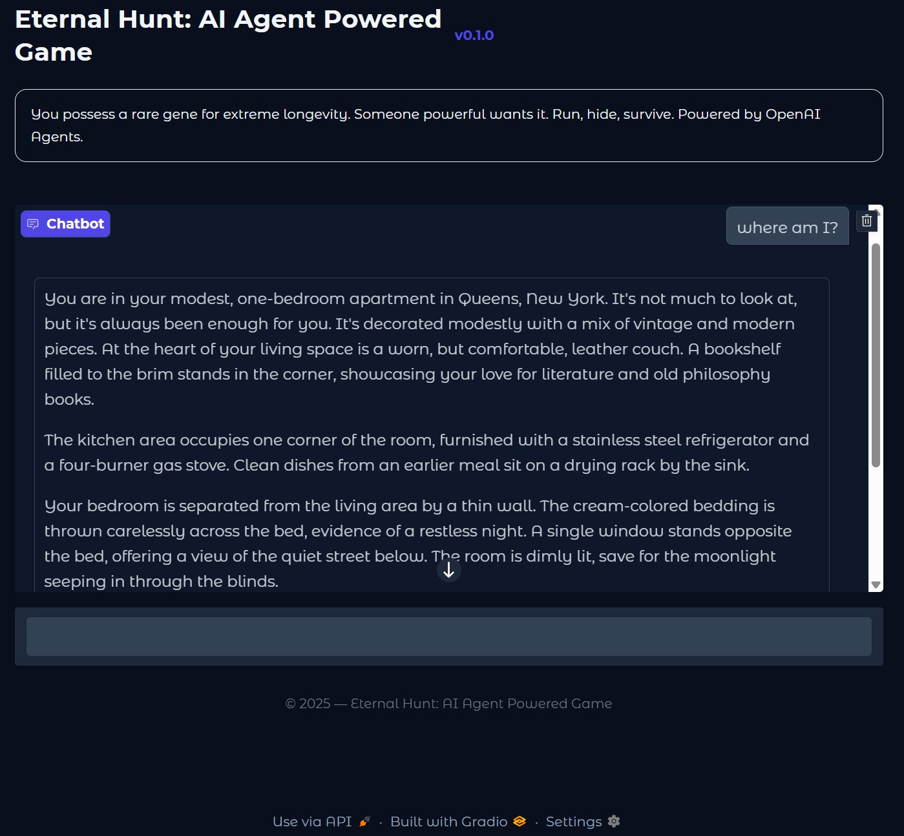
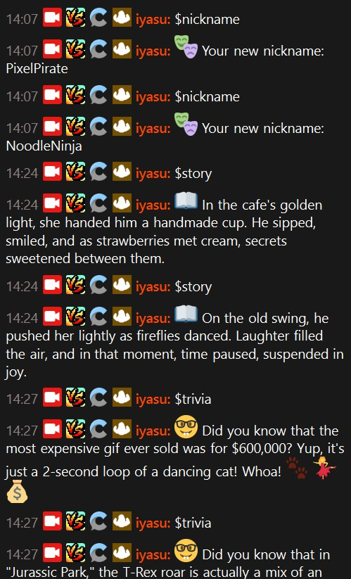
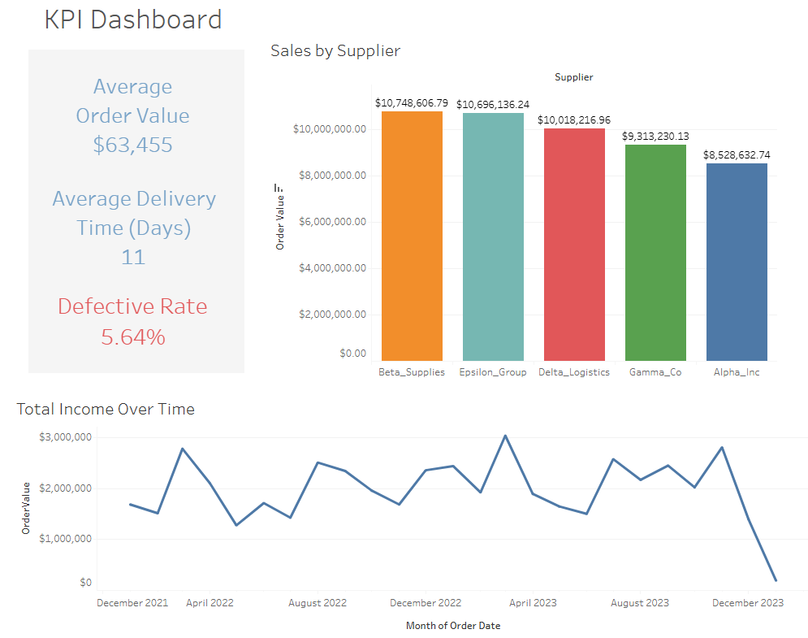
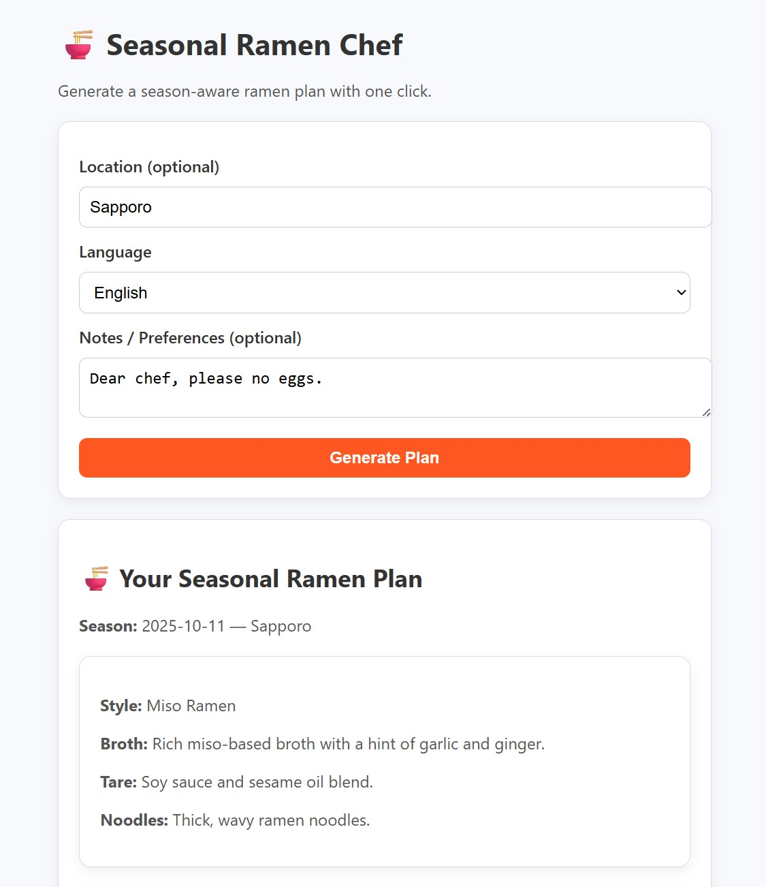
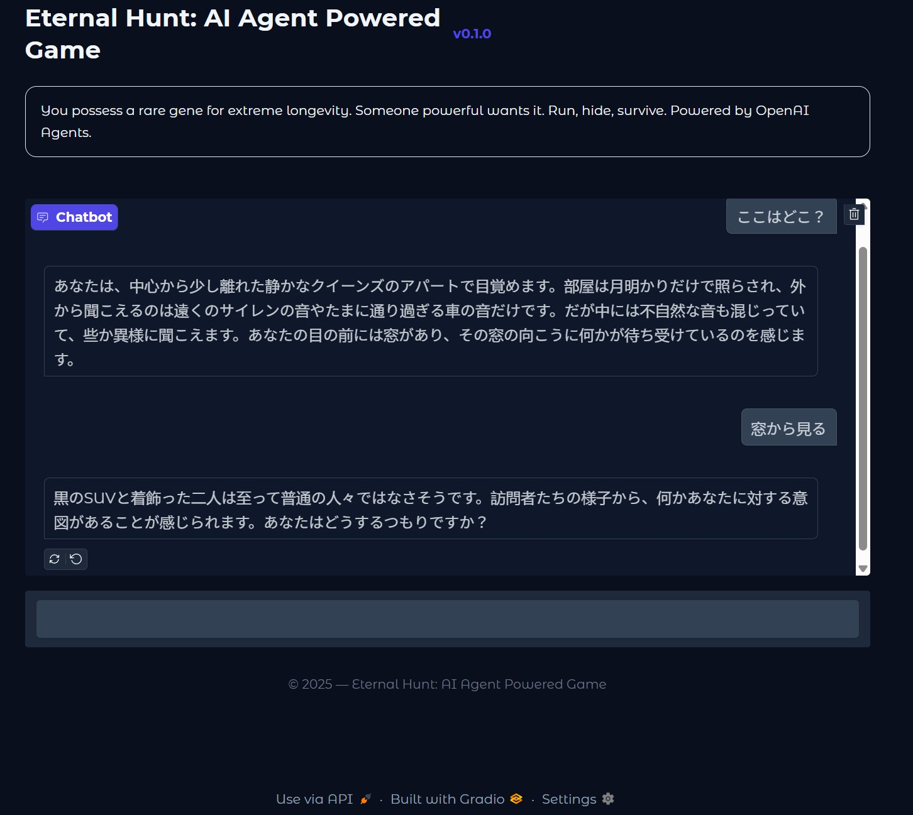
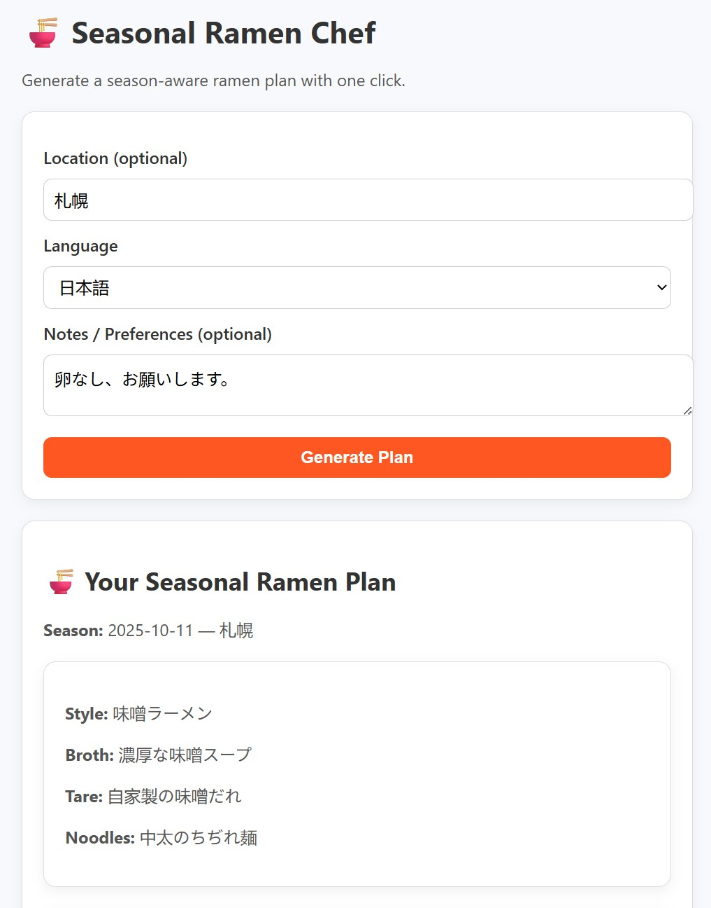

# AI & Software Projects

<h2>[日本語はこちら](#日本語版)</h2>

Welcome. This site showcases a collection of software I’ve built, ranging from AI-driven apps to other creative and technical projects.

## Table of Contents

- [AI Agent Thriller Game](#-ai-agent-thriller-game)
- [Twitch ChatGPT Bot](#-chatgpt-powered-twitch-bot-with-logging)
- [Data Analysis with Python](#-data-analysis-with-python)
- [Seasonal Ramen Chef AI Agent (Ruby + OpenAI)](#-seasonal-ramen-chef-ai-agent-ruby--openai)
- [Stats Utility App (Node + React + Rust + Python + Docker) - In Progress](#-stats-utility-app-node--react--rust--python--docker)
- [Custom-trained Llama agents orchestrated with LangChain - Pending](#-custom-trained-llama-agents-orchestrated-with-langchain--pending)

---

## 🎮 AI Agent Thriller Game

### Description

An interactive text adventure game called Eternal Hunt where an AI agent plays the role of the game narrator.
  
Using the OpenAI Agents SDK, this game features two AI agents that help tell a story. One agent is the narrator that interacts with the player. The other agent is a web researcher with access to the internet. The web researcher can only be contacted by the narrator agent when it needs access to real time information. The narrator agent is trained with the story background, has custom function tools, can save updates in the story log, and can conduct inventory management.
  
There is a Jupyter Notebook version of the game that walks through the game's main processes. The main Python application comes with both a Gradio and Streamlit UI.

### Code

[GitHub Repo](https://github.com/swallace100/thriller-game-ai-agent)

### Tech Stack

- Python
- Jupyter Notebook
- OpenAI Agents SDK
- Gradio
- Streamlit

### Screenshots

#### Gradio UI Screenshot

  

---

## 🤖 ChatGPT Powered Twitch Bot with Logging

### Description

A Twitch chatbot that integrates with OpenAI’s GPT models to keep offline chat entertaining.
It generates jokes, trivia, nicknames, micro-stories, and AI-generated images using custom prompts, while logging all chat messages by channel and date.
  
The bot was originally built with TwitchIO 2.x (IRC-based) and has now been fully updated to use Twitch’s modern EventSub WebSocket system, making it future-proof and aligned with Twitch’s recommended architecture.
  
This project demonstrates how to blend AI creativity with Twitch interactivity, offering a lively companion when streams are offline.

### Code

[GitHub Repo](https://github.com/swallace100/ChatGPT-Powered-Twitch-Bot-With-Logging)

### Tech Stack

- Python
- OpenAI API (Chat + Images)
- Twitch EventSub WebSockets
- dotenv
- Requests
- Web Sockets

### **Screenshots:**

#### Chat Responses

  

---

## 📊 Data Analysis with Python

### Description

A collection of Python-based data analysis projects showcasing techniques in data cleaning, visualization, and statistical exploration.
This repo demonstrates how to load and transform datasets, extract meaningful insights, and present findings using clear visualizations and concise summaries.
  
It highlights a practical workflow for working with real-world data: importing, preprocessing, exploring, and communicating results, which are essential skills for modern software engineers and AI practitioners.

### Code

[GitHub Repo](https://github.com/swallace100/data-analysis)

### Tech Stack

- Python
- Pandas
- NumPy
- Matplotlib
- Jupyter Notebook

### **Screenshots:**

#### KPI Dashboard

  

---

## 🍜 Seasonal Ramen Chef AI Agent (Ruby + OpenAI)

### Description

A lightweight AI-powered web app built with Ruby and Sinatra that role-plays as a “Seasonal Ramen Chef.”
It generates ramen recipes tailored to the current season and location, outputting structured JSON with broth, tare, noodles, toppings, garnish, and preparation steps.
  
This project highlights:

- How to integrate the OpenAI API into a Ruby app
- Using Sinatra for a minimal but functional web interface
- Enforcing structured outputs (JSON schema) for reliable AI responses
- A practical example of prompt-engineering and role consistency in a fun cooking context

### Code

[GitHub Repo](https://github.com/swallace100/data-analysis)

### Tech Stack

- Ruby (3.1+)
- Sinatra
- Puma
- Dotenv
- ruby-openai
- JavaScript (vanilla for the UI)

### **Screenshots:**

#### Ramen Recipe and Menu

  

---

## 📊 Stats Utility App (Node + React + Rust + Python + Docker)

### Description

Description

A containerized full-stack stats toolkit that makes data analysis faster and easier.
Users can upload datasets, run descriptive and inferential tests (t-tests, chi-square, ANOVA, regression), and instantly get clean tables, APA-style write-ups, and high-quality matplotlib visualizations.
  
This project highlights:

- A polyglot architecture: Node.js backend, React frontend, Rust microservice for high-performance calculations, and Python microservice for plotting
- Cross-service communication with Docker Compose for easy orchestration
- Shared type contracts (Zod/pydantic) to keep outputs reproducible and verifiable
- Real-world utility for coursework and research: automated summaries + exportable reports

### Code

[GitHub Repo](https://github.com/swallace100/stats-utility-app)

### Tech Stack

- React (Vite/Next) + Tailwind
- Node.js (TypeScript, Fastify/Express)
- Rust (Axum/Actix, numeric kernels)
- Python (FastAPI + Matplotlib)
- PostgreSQL + Redis (storage + jobs)
- Docker + Docker Compose

### **Screenshots:**

#### Statistics Visualization

Descriptive Stats and Visualization - Pending

  

---

## 🤖 Custom-trained Llama Agents Orchestrated with LangChain – Pending

### Description

A multi-agent system powered by custom-trained Llama models, orchestrated using LangChain.
  
The workflow consists of three specialized agents: a Researcher that gathers and organizes information, a Writer that produces clear and coherent text, and an Editor that fact-checks and refines the output. This pipeline can be applied to a wide variety of tasks, such as producing accurate reports, summarizing the latest news about a specific stock, or generating knowledge articles for a help desk.
  
By combining fine-tuned specialist models with LangChain orchestration, this project demonstrates how AI agents can collaborate to deliver higher quality, more reliable results than a single model working alone.

### Code

[GitHub Repo](https://github.com/swallace100/Custom-Llama-Agents-on-LangChain)

### Tech Stack

- Python
- Llama 3 (LoRA fine-tuning)
- LangChain
- FAISS (vector search)
- Streamlit

### Screenshots

#### Research and Output screenshot

Researcher -> Writer -> Pipeline - Pending
  

---

# 日本語版

<h2>[English version](#ai--software-projects)</h2>

ようこそ。このサイトでは、私が開発したソフトウェアを紹介する。AI を活用したアプリから、その他のクリエイティブや技術的なプロジェクトまで幅広く取り上げている。

## 目次

- [AI Agent のスリラーのゲーム](#-ai-agent-のスリラーのゲーム)
- [Twitch ChatGPT ボット](#-chatgpt-搭載-twitch-ボットチャットログ付き)
- [Python を用いたデータ分析](#-python-を用いたデータ分析)
- [季節のラーメンシェフ AI エージェント（Ruby + OpenAI）](#-季節のラーメンシェフ-ai-エージェントruby--openai)
- [統計ユーティリティアプリ (Node + React + Rust + Python + Docker) – 開発中](#-統計ユーティリティアプリ-node--react--rust--python--docker--開発中)
- [カスタム学習した Llama エージェントを LangChain でオーケストレーション - 開発中](#-カスタム学習-llama-エージェントと-langchain-によるオーケストレーション--準備中)

## 🎮 AI Agent のスリラーのゲーム

### 概要

『永遠の狩り』はインタラクティブなテキストアドベンチャーゲームで、AI エージェントがナレーターとして登場する。
  
このゲームは OpenAI の Agents SDK を活用し、二つの AI エージェントがストーリーを伝える。一つのエージェントはナレーターとなりプレイヤーとやり取りし、もう一つのエージェントはインターネットにアクセスして情報を調べる研究者の役割を果たす。研究者エージェントには、ナレーターエージェントがリアルタイムの情報を必要とする時だけ連携できる。ナレーターエージェントはストーリーに基づいて学習されており、カスタム機能を備えている。さらに、ストーリーの変更をログに保存したり、在庫管理を行ったりすることも行える。
  
Jupyter Notebook 版では、ゲームの主な処理の流れを示している。メインの Python アプリケーションは、Gradio と Streamlit の UI を備えている。

### コード

[GitHub Repo](https://github.com/swallace100/thriller-game-ai-agent)

### 技術スタック

- Python
- Jupyter Notebook
- OpenAI Agents SDK
- Gradio
- Streamlit

### スクリーンショット

#### Gradio UI のスクリーンショット

---

## 🤖 ChatGPT 搭載 Twitch ボット（チャットログ付き）

### 概要

OpenAI の GPT モデルを活用し、ジョーク、トリビア、ニックネーム、マイクロストーリー、AI 画像生成 を行う Twitch チャットボット。
チャットメッセージはチャンネルごと・日付ごとにログファイルとして保存され、オフライン時でも配信の場を盛り上げる存在となる。
  
当初は TwitchIO 2.x（IRC ベース）を用いて構築されたが、現在は Twitch の最新システム EventSub WebSocket を利用するよう完全に更新済み。これにより、将来的にも安定して利用できる設計となっている。
  
AI の創造性と Twitch のインタラクティブ性を融合させ、オフライン時でも視聴者を楽しませるコンパニオンとして機能する。

### コード

[GitHub リポジトリ](https://github.com/swallace100/ChatGPT-Powered-Twitch-Bot-With-Logging)

### 技術スタック

- Python
- OpenAI API
- Twitch EventSub WebSocket
- dotenv
- Requests
- WebSockets

### スクリーンショット

#### チャット応答例

  

---

## 📊 Python を用いたデータ分析

### 概要

Python を活用したデータ分析プロジェクトのコレクションで、データのクリーニング、可視化、統計的な探索 の手法を紹介しています。
このリポジトリでは、データセットを読み込み・変換し、有益なインサイトを抽出し、明確な可視化や簡潔な要約で結果を提示する方法を示しています。
  
実際のデータに取り組む際の実践的なワークフロー（インポート、前処理、探索、結果の伝達）を強調しており、現代のソフトウェアエンジニアや AI 実務者に不可欠なスキルを体現しています。

### コード

[GitHub リポジトリ](https://github.com/swallace100/data-analysis)

### 技術スタック

- Python
- Pandas
- Numpy
- Matplotlib
- Jupyter Notebook

### スクリーンショット

#### KPI ダッシュボード

  

---

## 🍜 季節のラーメンシェフ AI エージェント（Ruby + OpenAI）

### 説明

Ruby と Sinatra を使って構築した軽量な AI ウェブアプリで、「季節のラーメンシェフ」として役割を果たします。  
現在の季節や地域に合わせたラーメンレシピを生成し、スープ、タレ、麺、トッピング、薬味、調理手順などを JSON 形式で出力します。  
  
このプロジェクトのポイント:

- **OpenAI API** を Ruby アプリに統合する方法
- **Sinatra** を使ったシンプルかつ機能的なウェブインターフェース
- **JSON スキーマ** を利用して構造化された出力を保証
- プロンプト設計と役割一貫性の実例を、楽しい料理テーマで実現

### コード

[GitHub リポジトリ](https://github.com/swallace100/ramen-chef-agent)

### 技術スタック

- Ruby (3.1+)
- Sinatra
- Puma
- Dotenv
- ruby-openai
- JavaScript（UI はバニラ）

### スクリーンショット

#### ウェブインターフェース

  

---

## 📊 統計ユーティリティアプリ (Node + React + Rust + Python + Docker) – 開発中

### 概要

データ分析をより速く、簡単にするためのコンテナ化フルスタック統計ツールです。
ユーザーはデータセットをアップロードし、記述統計や推測統計（t 検定、カイ二乗検定、ANOVA、回帰分析など）を実行し、整った表、APA スタイルの結果文、そして高品質な matplotlib グラフを即座に得ることができます。
  
このプロジェクトの特徴:

- Node.js バックエンド、React フロントエンド、高速計算用の Rust マイクロサービス、可視化用の Python マイクロサービスによるポリグロット構成
- Docker Compose によるクロスサービス通信と容易なオーケストレーション
- 出力の再現性と検証性を保つための共有型定義（Zod / pydantic）
- 授業や研究に実用的：自動生成された要約とエクスポート可能なレポート

### コード

[GitHub リポジトリ](https://github.com/swallace100/stats-utility-app)

### 技術スタック

- React (Vite/Next) + Tailwind
- Node.js (TypeScript, Fastify/Express)
- Rust (Axum/Actix, 数値計算カーネル)
- Python (FastAPI + Matplotlib)
- PostgreSQL + Redis (ストレージ + ジョブ管理)
- Docker + Docker Compose

### スクリーンショット

#### 記述統計と可視化　－　準備中

  

## 🤖 カスタム学習 Llama エージェントと LangChain によるオーケストレーション – 準備中

### 概要

カスタム学習した Llama モデルを活用し、LangChain でオーケストレーションしたマルチエージェントシステムです。
  
ワークフローは 3 つの専門エージェントで構成されています。リサーチャーが情報を収集・整理し、ライターが分かりやすく一貫性のある文章を生成し、エディターが事実確認と推敲を行います。このパイプラインにより、特定の株に関する最新ニュースの要約や正確なレポート作成、ヘルプデスク記事の生成など、幅広いタスクに対応できます。
  
専門的に調整されたモデルと LangChain の連携により、単一モデルでは実現が難しい、高品質で信頼性の高いアウトプットを生成できることを実証します。

### コード

[GitHub リポジトリ](https://github.com/swallace100/Custom-Llama-Agents-on-LangChain)

### 技術スタック

- Python
- Llama 3 (LoRA ファインチューニング)
- LangChain
- FAISS（ベクトル検索）
- Streamlit

### スクリーンショット

#### パイプライン　－　準備中

  
