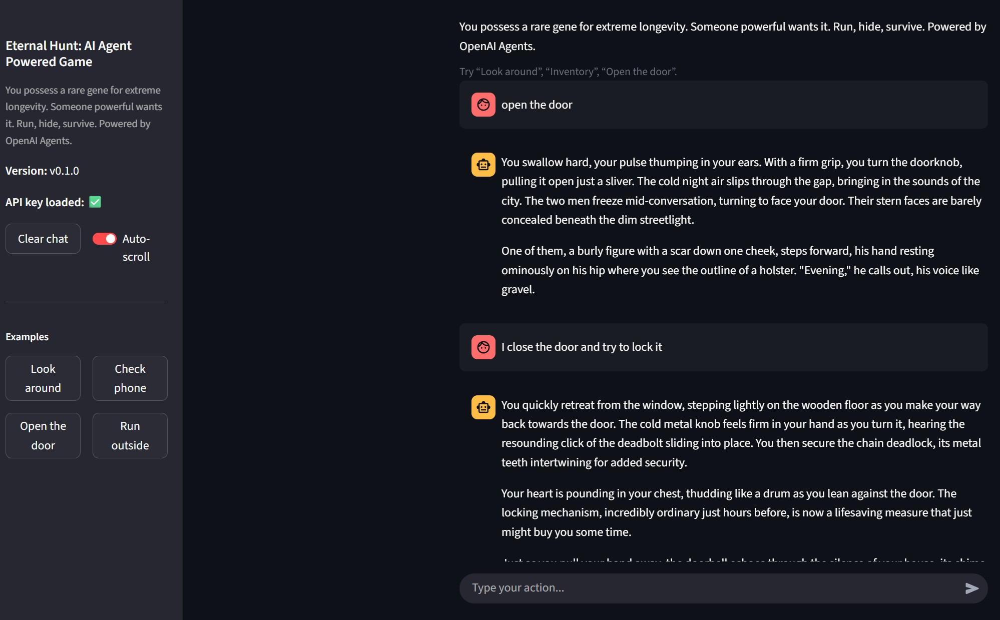
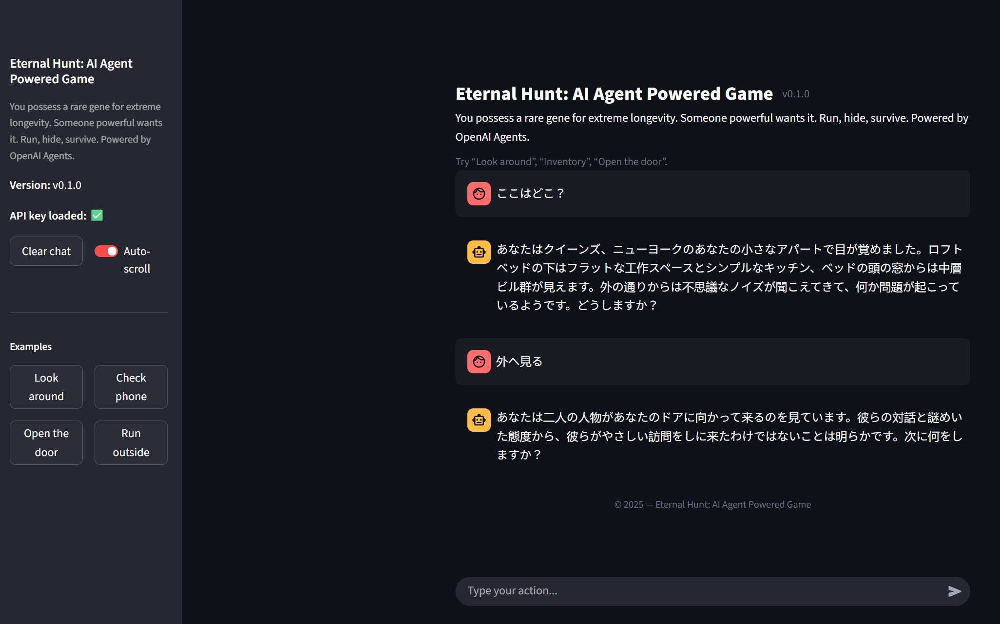

# AI and Software Projects by Steven Wallace
[日本語はこちら](#日本語版)

Welcome. This site showcases a collection of software I’ve built, ranging from AI-driven apps to other creative and technical projects.

---

## 🎮 AI Agent Thriller Game (OpenAI Agent SDK)

### Description
An interactive text adventure game called Eternal Hunt where the AI plays the role of a thriller game narrator.  
Using the OpenAI Agents SDK, this game features two AI agents that help tell a story. One agent is the narrator that interacts with the player. The other agent is a web researcher with access to the internet. The web researcher can only be contacted by the narrator agent when it needs access to real time information. The narrator agent is trained with the story background, has custom function tools, can save updates in the story log, and can conduct inventory management.

There is a Jupyter Notebook version of the game that walks through the game's main processes. The main Python application with comes with both a Gradio and Streamlit UI.

### Code
[GitHub Repo](https://github.com/swallace100/thriller-game-ai-agent)

### Built With
- Python
- Jupyter Notebook
- OpenAI Agents SDK
- Gradio
- Streamlit

### **Screenshots:** 

---

## 💬 Twitch ChatGPT Bot
**Description:** A Twitch chatbot powered by ChatGPT that can banter, run polls, and interact with viewers.  
**Code:** [GitHub Repo](https://github.com/swallace100/twitch-bot)

---

## 🍜 Seasonal Ramen Generator (Ruby + OpenAI)
**Description:** Suggests ramen recipes based on the current season and seasonal Japanese ingredients.  
**Code:** Coming soon!

---

# 日本語版
[English version](#ai-and-software-projects-by-steven-wallace)

## 🎮 スリラーゲーム (OpenAI Agent SDK)
**概要:** AIがナレーターとして登場するテキストアドベンチャー。  
**コード:** [GitHub Repo](https://github.com/swallace100/thriller-game-ai-agent)

---

## 💬 Twitch ChatGPTボット
**概要:** ChatGPTを使ったTwitch用チャットボット。視聴者と雑談したり、投票を実施したりできます。  
**コード:** [GitHubリポジトリ](https://github.com/swallace100/twitch-bot)

---

## 🍜 季節のラーメンジェネレーター (Ruby + OpenAI)
**概要:** 季節に応じた食材を使ったラーメンレシピを提案します。  
**コード:** 近日公開！
