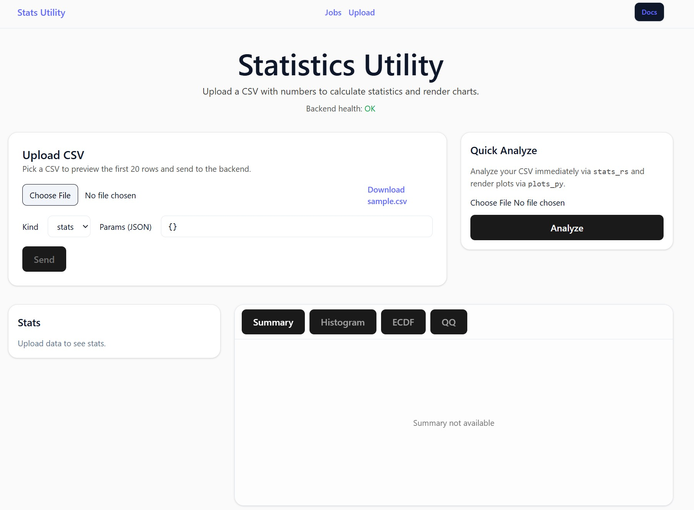
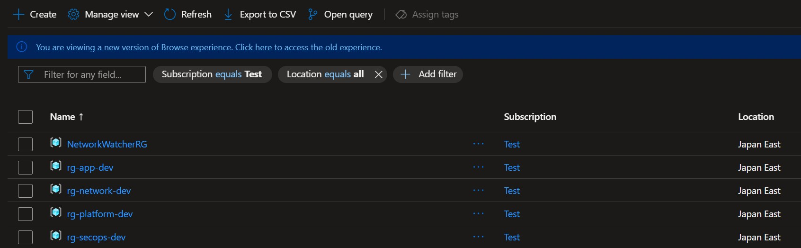

# AI & Software Projects

[日本語はこちら](#日本語版)

Welcome. This site showcases a collection of software I’ve built, ranging from AI-driven apps to other creative and technical projects.

## Table of Contents

- [Stats Utility App (Node + React + Rust + Python + Docker)](#-stats-utility-app-node--react--rust--python--docker)
- [Azure Enterprise Architecture Starter Kit (Bicep)](#-azure-enterprise-architecture-starter-kit-bicep)
- [Custom-trained Phi-3 agents orchestrated with LangChain](#-custom-trained-phi-3-agents-orchestrated-with-langchain)
- [.NET CI/CD Pipeline with Docker + GitHub Actions](#cicd-en)
- [ASP.NET to .NET 10 Migration Samples](#aspnet-en)
- [Seasonal Ramen Chef AI Agent (Ruby + OpenAI)](#-seasonal-ramen-chef-ai-agent-ruby--openai)

---

## 📊 Stats Utility App (Node + React + Rust + Python + Docker)

### Description

A fully containerized full-stack statistics toolkit for fast, reproducible data analysis.  
Users can upload CSV files, run descriptive and inferential tests, and instantly view clean results and visualizations — all powered by a multi-language architecture.  
  
This project highlights:

- **Polyglot architecture:** Node.js backend, React frontend, Rust microservice for high-performance statistical calculations, and Python microservice for plotting
- **Cross-service orchestration:** All services run locally with Docker Compose and health checks
- **Seamless integration:** React UI → Node backend → Rust (stats) → Python (plots)
- **Practical design:** A compact analytics tool for coursework, prototypes, or research automation

### Code

[GitHub Repo](https://github.com/swallace100/stats-utility-app)

### Tech Stack

- React (Vite) + Tailwind + shadcn/ui
- Node.js (Express + TypeScript)
- Rust (Axum + serde for numeric kernels)
- Python (FastAPI + Matplotlib)
- Docker + Docker Compose

### **Screenshots:**

#### UI with summary stats, ECDF, and QQ diagnostics

  

---

## 🏢 Azure Enterprise Architecture Starter Kit (Bicep)

### Description

A fully automated Azure landing zone starter kit built using Bicep to help organizations deploy a secure, enterprise-ready cloud foundation in minutes.
This project provisions core Azure infrastructure with opinionated best practices: resource group layout, tagging governance, secure storage, Key Vault with RBAC, virtual networking, Log Analytics with a Data Collection Rule, and managed identities ready for OIDC pipelines.
  
It’s designed as a practical starting point for real companies, students, and engineers who want to learn cloud architecture through working code, not PDFs.
Deploy once → Azure is fully structured with security, compliance, observability, and CI/CD identity ready to go.

### Code

[GitHub Repo](https://github.com/swallace100/azure-enterprise-architecture-starter-kit)

### Tech Stack

- Azure Subscriptions & Resource Groups
- Bicep (infrastructure as code)
- Azure Policy (tag enforcement, no public blob, TLS)
- Log Analytics + Data Collection Rule (monitoring pipeline)
- Key Vault (RBAC mode)
- Storage (Data Lake Gen2, private options)
- Virtual Network with subnets
- Managed Identities (CI/CD & workloads)
- GitHub OIDC deployment pipeline

### **Screenshots:**

#### Azure Resource Groups

  

---

## 🤖 Custom-trained Phi-3 Agents Orchestrated with LangChain

### Description

A multi-agent system powered by custom-trained Phi-3 models, orchestrated using LangChain.
  
The workflow consists of three specialized agents: a Researcher that gathers and organizes information, a Writer that produces clear and coherent text, and an Editor that fact-checks and refines the output. This pipeline can be applied to a wide variety of tasks, such as producing accurate reports, summarizing the latest news about a specific stock, or generating knowledge articles for a help desk.
  
By combining fine-tuned specialist models with LangChain orchestration, this project demonstrates how AI agents can collaborate to deliver higher quality, more reliable results than a single model working alone.

### Code

[GitHub Repo](https://github.com/swallace100/Custom-Phi-3-Agents-on-LangChain)

### Tech Stack

- Python
- Phi-3 (LoRA fine-tuning)
- LangChain
- FAISS (vector search)
- Streamlit

### Screenshots

#### Research and Output screenshot

Researcher -> Writer -> Pipeline - Pending
  

---

##  🚀 .NET CI/CD Pipeline with Docker + GitHub Actions

### Description

A minimal, production-ready example repository demonstrating how to build, containerize, and deploy a .NET 10 Minimal Web API using Docker and GitHub Actions CI/CD automation.
  
This project includes a multi-stage Dockerfile, Docker Compose support for local development, and a GitHub Actions pipeline designed to perform automated image builds and smoke testing. The goal of this repo is to provide a clean reference architecture for modern DevOps workflows and container-based application delivery.
  
The sample API includes endpoints for health checks and simple interactions, and is ready for expansion with automated deployments, GHCR container registry integration, and remote server rollout via SSH.

### Code

[GitHub Repo](https://github.com/swallace100/ci-cd-pipelines-github-actions-docker-compose)

### Tech Stack

- .NET 10 Minimal API
- Docker & Docker Compose
- GitHub Actions CI/CD
- Swagger / OpenAPI
- Curl smoke testing
- GHCR (future expansion)

### Endpoints

| Method | Route           | Description                   |
| ------ | --------------- | ----------------------------- |
| GET    | `/`             | Greeting endpoint             |
| GET    | `/health`       | CI/CD health check endpoint   |
| GET    | `/greet/{name}` | Example parameter route       |
| GET    | `/swagger`      | Interactive API documentation |

---

##  🧩 ASP.NET to .NET 10 Migration Samples

### Description

A collection of real-world sample projects that demonstrate how to migrate legacy ASP.NET (System.Web) applications to modern .NET 10, ASP.NET Core, and Blazor.
This repository provides step-by-step upgrade examples based on Microsoft’s original aspnet/samples archive, showing how to port HttpClient samples, Web API, MVC, Identity, and Katana middleware from .NET Framework to modern .NET.
  
The goal is to provide working reference implementations, not theoretical guides — enabling developers to understand the full modernization process, solve common migration errors, and adopt modern hosting models such as Minimal APIs, dependency injection, configuration via appsettings.json, and Blazor UI components.
  
These examples are ideal for engineers modernizing existing enterprise applications, students learning modern .NET architecture, or teams preparing for large-scale modernization projects.

### Code

[GitHub Repo](https://github.com/swallace100/aspdotnet-dotnet-upgrade)

### Tech Stack

- Legacy ASP.NET (.NET Framework 4.x)
- .NET 10 SDK & Runtime
- ASP.NET Core 10
- Minimal Hosting Model (Program.cs)
- Blazor UI & Razor Components
- HttpClient + HttpClientFactory
- Identity modernizations
- MVC / Web API upgrades
- Configuration via appsettings.json

### Examples include

- HttpClient → modern HttpClientFactory patterns
- Web API → ASP.NET Core Web API (Pending)
- MVC5 → ASP.NET Core MVC & RazorI (Pending)
- Identity → modern auth & middleware configurationI (Pending)
- Katana → Middleware via ASP.NET Core pipelineI (Pending)

  

---

## 🍜 Seasonal Ramen Chef AI Agent (Ruby + OpenAI)

### Description

A lightweight AI-powered web app built with Ruby and Sinatra that role-plays as a “Seasonal Ramen Chef.”
It generates ramen recipes tailored to the current season and location, outputting structured JSON with broth, tare, noodles, toppings, garnish, and preparation steps.
  
This project highlights:

- How to integrate the OpenAI API into a Ruby app
- Using Sinatra for a minimal but functional web interface
- Enforcing structured outputs (JSON schema) for reliable AI responses
- A practical example of prompt-engineering and role consistency in a fun cooking context

### Code

[GitHub Repo](https://github.com/swallace100/data-analysis)

### Tech Stack

- Ruby (3.1+)
- Sinatra
- Puma
- Dotenv
- ruby-openai
- JavaScript (vanilla for the UI)

### **Screenshots:**

#### Ramen Recipe and Menu

  

---

# 日本語版

[English version](#ai--software-projects)

ようこそ。このサイトでは、私が開発したソフトウェアを紹介する。AI を活用したアプリから、その他のクリエイティブや技術的なプロジェクトまで幅広く取り上げている。

## 目次

- [統計ユーティリティアプリ (Node + React + Rust + Python + Docker)](#-統計ユーティリティアプリ-node--react--rust--python--docker--開発中)
- [Azure Enterprise Architecture Starter Kit (Bicep) (JP)](#-azure-enterprise-architecture-starter-kit-bicep-jp)
- [カスタム学習した Phi-3 エージェントを LangChain でオーケストレーション](#-カスタム学習-phi-3-エージェントと-langchain-によるオーケストレーション)
- [.NET CI/CD パイプライン（Docker + GitHub Actions）](#cicd-ja)
- [ASP.NET へ .NET 10 マイグレーション サンプル](#aspnet-ja)
- [季節のラーメンシェフ AI エージェント（Ruby + OpenAI）](#-季節のラーメンシェフ-ai-エージェントruby--openai)

---

## 📊 統計ユーティリティアプリ (Node + React + Rust + Python + Docker) – 開発中

### 概要

データ分析をより速く、より簡単に行うための **フルスタック統計ツールキット**。  
CSV ファイルをアップロードするだけで、記述統計・推測統計（t 検定、カイ二乗、ANOVA、回帰など）を実行し、  
結果を自動的に整ったテーブルやグラフとして表示します。  
  
このプロジェクトの特徴：

- **ポリグロット構成：** Node.js 製バックエンド、React 製フロントエンド、高速計算用 Rust マイクロサービス、グラフ生成用 Python マイクロサービス
- **クロスサービス連携：** Docker Compose による容易なコンテナオーケストレーション
- **型安全な連携：** Zod／pydantic による共通データスキーマで、結果の再現性と整合性を保証
- **実用性重視：** 学習・研究・プロトタイプ用途で使える自動統計レポート生成ツール

### コード

[GitHub リポジトリ](https://github.com/swallace100/stats-utility-app)

### 技術スタック

- React（Vite）＋ Tailwind ＋ shadcn/ui
- Node.js（Express + TypeScript）
- Rust（Axum + serde による数値カーネル処理）
- Python（FastAPI + Matplotlib）
- Docker + Docker Compose

### スクリーンショット

#### 統計結果とグラフの UI 画面

  

---

## 🏢 Azure Enterprise Architecture Starter Kit (Bicep) (JP)

### 概要

このリポジトリは、Bicep を用いて Azure のエンタープライズ向けランディングゾーンを自動構築できるスターターキットです。
数分で、安全性・運用性・ガバナンスを備えたクラウド基盤を Azure 上に展開できます。

本プロジェクトでは、実務で必要となるコア構成をまとめてデプロイします：リソースグループの標準構成、タグ付けガバナンス、セキュアなストレージ (Data Lake Gen2)、Key Vault（RBAC モード）、仮想ネットワークとサブネット、Log Analytics & Data Collection Rule による監視基盤、と OIDC パイプラインに対応したユーザー割り当てマネージド ID
  
「ドキュメントを見るだけ」ではなく、動くコードを通して Azure アーキテクチャを学べることを重視しています。
一度デプロイするだけで、セキュリティ・コンプライアンス・監視・CI/CD まで整った Azure 環境を構築できます。

### コード

[GitHub リポジトリ](https://github.com/swallace100/azure-enterprise-architecture-starter-kit)

### 技術スタック

- Azure サブスクリプション & リソースグループ
- Bicep（IaC）
- Azure Policy（タグ必須化 / Blob 公開禁止 / TLS1.2+）
- Log Analytics + Data Collection Rule
- Key Vault（RBAC、パージ保護）
- Storage（階層型ネームスペース / セキュア設定）
- Virtual Network & サブネット
- ユーザー割り当てマネージド ID（CI/CD & ワークロード）
- GitHub OIDC デプロイパイプライン対応

### スクリーンショット

#### Azure リソースグループ構成

  

---

## 🤖 カスタム学習 Phi-3 エージェントと LangChain によるオーケストレーション

### 概要

カスタム学習した Phi-3 モデルを活用し、LangChain でオーケストレーションしたマルチエージェントシステムです。
  
ワークフローは 3 つの専門エージェントで構成されています。リサーチャーが情報を収集・整理し、ライターが分かりやすく一貫性のある文章を生成し、エディターが事実確認と推敲を行います。このパイプラインにより、特定の株に関する最新ニュースの要約や正確なレポート作成、ヘルプデスク記事の生成など、幅広いタスクに対応できます。
  
専門的に調整されたモデルと LangChain の連携により、単一モデルでは実現が難しい、高品質で信頼性の高いアウトプットを生成できることを実証します。

### コード

[GitHub リポジトリ](https://github.com/swallace100/Custom-Phi-3-Agents-on-LangChain)

### 技術スタック

- Python
- Phi-3 (LoRA ファインチューニング)
- LangChain
- FAISS（ベクトル検索）
- Streamlit

### スクリーンショット

#### パイプライン　－　準備中

  

---

##  🚀 .NET CI/CD パイプライン（Docker + GitHub Actions）

### 概要

Docker と GitHub Actions を活用し、.NET 10 Minimal Web API をビルド・コンテナ化・デプロイするための、最小構成かつ本番運用レベルのサンプルリポジトリです。
  
本プロジェクトには、マルチステージ構成の Dockerfile、ローカル開発向けの Docker Compose、そして自動ビルドとスモークテストを実行する GitHub Actions パイプラインが含まれています。
このリポジトリの目的は、モダンな DevOps ワークフローおよびコンテナベースのアプリケーション配信における、シンプルで再利用性の高いリファレンスアーキテクチャを提供することです。
  
サンプル API には、ヘルスチェックや基本的な API 操作ポイントが用意されており、将来的には自動デプロイ、GHCR コンテナレジストリ統合、SSH 経由のリモートロールアウトなどに拡張できる構成になっています。

### コード

[GitHub Repo](https://github.com/swallace100/ci-cd-pipelines-github-actions-docker-compose)

### 技術スタック

- .NET 10 Minimal API
- Docker / Docker Compose
- GitHub Actions CI/CD
- Swagger / OpenAPI
- Curl スモークテスト
- GHCR（今後の拡張予定）

### エンドポイント

| Method | Route           | 説明                               |
| ------ | --------------- | ---------------------------------- |
| GET    | `/`             | 挨拶メッセージを返すエンドポイント |
| GET    | `/health`       | CI/CD 用のヘルスチェック           |
| GET    | `/greet/{name}` | パラメータ付きレスポンス例         |
| GET    | `/swagger`      | インタラクティブ API ドキュメント  |

  

---

##  🧩 ASP.NET へ .NET 10 マイグレーション サンプル

### 概要

このリポジトリは、レガシーな ASP.NET (System.Web) アプリケーションを 最新の .NET 10 / ASP.NET Core / Blazor へ移行するための、実践的なサンプルプロジェクト集です。
Microsoft の公式 aspnet/samples アーカイブをベースに、HttpClient、Web API、MVC、Identity、Katana ミドルウェア等を .NET Framework から最新 .NET へ移行する手順とポイント を段階的に示しています。
  
理論だけではなく 実際に動作する参考実装 を提供することで、開発者がモダナイゼーションの流れを理解し、よく発生する移行エラーを解決し、Minimal APIs、依存性注入 (DI)、appsettings.json による設定管理、Blazor UI コンポーネント などの 最新アーキテクチャを採用できるよう支援します。
  
既存の業務システムを刷新するエンジニア、最新の .NET アーキテクチャを学ぶ学生、または大規模移行プロジェクトに備えるチームに最適です。

### コード

[GitHub リポジトリ](https://github.com/swallace100/aspdotnet-dotnet-upgrade)

### 技術スタック / Tech Stack

- レガシー ASP.NET (.NET Framework 4.x)
- .NET 10 SDK & Runtime
- ASP.NET Core 10
- Minimal Hosting Model (Program.cs)
- Blazor UI & Razor Components
- HttpClient + HttpClientFactory
- Identity の最新化
- MVC / Web API のアップグレード
- appsettings.json による設定管理

### 含まれるサンプル例

- HttpClient → 最新 HttpClientFactory パターン
- Web API → ASP.NET Core Web API への移行 (作業中)
- MVC5 → ASP.NET Core MVC & Razor への移行 (作業中)
- Identity → 最新認証 & ミドルウェア構成 (作業中)
- Katana → ASP.NET Core ミドルウェア パイプライン (作業中)

  

---

## 🍜 季節のラーメンシェフ AI エージェント（Ruby + OpenAI）

### 説明

Ruby と Sinatra を使って構築した軽量な AI ウェブアプリで、「季節のラーメンシェフ」として役割を果たします。  
現在の季節や地域に合わせたラーメンレシピを生成し、スープ、タレ、麺、トッピング、薬味、調理手順などを JSON 形式で出力します。  
  
このプロジェクトのポイント:

- **OpenAI API** を Ruby アプリに統合する方法
- **Sinatra** を使ったシンプルかつ機能的なウェブインターフェース
- **JSON スキーマ** を利用して構造化された出力を保証
- プロンプト設計と役割一貫性の実例を、楽しい料理テーマで実現

### コード

[GitHub リポジトリ](https://github.com/swallace100/ramen-chef-agent)

### 技術スタック

- Ruby (3.1+)
- Sinatra
- Puma
- Dotenv
- ruby-openai
- JavaScript（UI はバニラ）

### スクリーンショット

#### ウェブインターフェース

  

---

